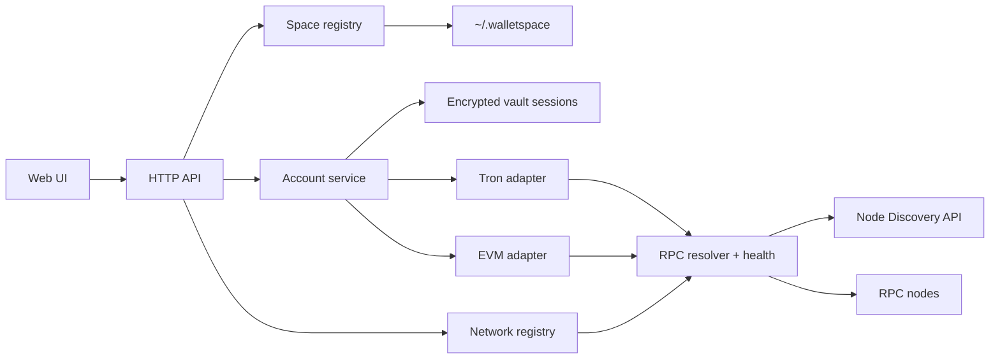

# План реализации Walletspace: spaces и multichain

Статус документа: целевая архитектура до начала миграции.

Документ описывает переход от текущего локального Tron-only приложения к
Walletspace первой итерации:

- несколько изолированных spaces — коллекций кошельков;
- создание derived-кошельков и импорт secp256k1-приватников;
- одновременная работа с Tron и несколькими EVM-сетями без перезапуска;
- хранение всех данных в `~/.walletspace`;
- архитектурный задел под Solana и TON без преждевременной реализации их
  специфики.

Первая поставка считается готовой только после поддержки всех сетей из
[матрицы первой итерации](#сети-первой-итерации). Этапы ниже — порядок
реализации внутри этой поставки, а не отдельные продуктовые релизы.

## 1. Текущая точка и основные разрывы

Сейчас приложение:

- загружает `./config.yaml`;
- хранит `mnemonic.txt` и `wallets.json` в `./data`;
- имеет одну BIP39-мнемонику и один список Tron-адресов;
- выбирает одну Tron-сеть глобально на старте;
- передаёт `*ecdsa.PrivateKey` из wallet-store в Tron-сервис;
- использует маршруты `/api/wallets/{index}/...`;
- содержит Tron-специфичные типы на уровне HTTP API;
- уже умеет прогрессивно загружать балансы и точечно обновлять затронутые
  кошельки после транзакции.

Нельзя просто добавить поле `chain` в текущую модель:

1. Derived account с индексом `i` использует разные derivation paths для Tron и
   EVM, то есть это разные приватные ключи.
2. Импортированный secp256k1-ключ, наоборот, один и тот же для Tron и всех EVM
   сетей; меняется только кодирование адреса.
3. Глобальная «активная сеть» в backend создаст гонки между вкладками,
   фоновыми обновлениями и отправкой транзакций.
4. Раздельные `accounts.json` и `keystore.json` нельзя атомарно обновить при
   импорте приватника.
5. Динамически найденной RPC-ноде нельзя доверять заявленный chain ID.

Эти разрывы должны быть устранены до добавления EVM.

## 2. Термины и инварианты

| Термин     | Значение                                                                                                           |
| ---------- | ------------------------------------------------------------------------------------------------------------------ |
| space      | Изолированная коллекция аккаунтов с отдельным vault и паролем. Может иметь BIP39 root seed и импортированные ключи |
| account    | Видимая пользователю единица кошелька внутри space                                                                 |
| key source | Источник подписи account: derived из seed или импортированный приватный ключ                                       |
| family     | Семейство протокола и адреса: `tron`, `evm`, позже `solana`, `ton`                                                 |
| network    | Конкретная исполняемая сеть: `ethereum-mainnet`, `tron-nile`, `bsc-testnet`                                        |
| asset      | Нативная монета или токен конкретной сети                                                                          |
| adapter    | Реализация сетевых операций для family                                                                             |

Обязательные инварианты:

- `space_id`, `account_id` и `network_id` — стабильные opaque ID; имя space и
  label аккаунта можно менять.
- Имена пользователя никогда не используются как имена каталогов или path
  parameters без ID.
- Network всегда явно передаётся в запросе. В backend нет изменяемого
  глобального `activeNetwork`.
- EVM chain ID хранится строкой или `big.Int`, а не JavaScript `number`.
- Адрес принадлежит паре `(account, address family)`, а не network:
  EVM-адрес одинаков во всех EVM-сетях, Tron-адрес одинаков в mainnet и Nile.
- Баланс, nonce, fee estimate, tx и кеш всегда принадлежат конкретному
  `network_id`.
- Подпись выполняется только локально. RPC никогда не получает приватный ключ.
- Заблокированный space не может подписывать, импортировать или экспортировать
  ключи.

## 3. Сети первой итерации

В первой итерации поддерживается 16 сетей.

| Network ID          | Family | Сеть                    | Network/chain ID | Native asset | Testnet |
| ------------------- | ------ | ----------------------- | ---------------: | ------------ | ------- |
| `tron-mainnet`      | Tron   | Mainnet                 |        `mainnet` | TRX          | нет     |
| `tron-nile`         | Tron   | Nile                    |           `nile` | TRX          | да      |
| `ethereum-mainnet`  | EVM    | Ethereum Mainnet        |              `1` | ETH          | нет     |
| `ethereum-sepolia`  | EVM    | Ethereum Sepolia        |       `11155111` | ETH          | да      |
| `bsc-mainnet`       | EVM    | BNB Smart Chain         |             `56` | BNB          | нет     |
| `bsc-testnet`       | EVM    | BNB Smart Chain Testnet |             `97` | tBNB         | да      |
| `polygon-mainnet`   | EVM    | Polygon PoS             |            `137` | POL          | нет     |
| `polygon-amoy`      | EVM    | Polygon Amoy            |          `80002` | POL          | да      |
| `optimism-mainnet`  | EVM    | OP Mainnet              |             `10` | ETH          | нет     |
| `optimism-sepolia`  | EVM    | OP Sepolia              |       `11155420` | ETH          | да      |
| `arbitrum-mainnet`  | EVM    | Arbitrum One            |          `42161` | ETH          | нет     |
| `arbitrum-sepolia`  | EVM    | Arbitrum Sepolia        |         `421614` | ETH          | да      |
| `robinhood-mainnet` | EVM    | Robinhood Chain         |           `4663` | ETH          | нет     |
| `robinhood-testnet` | EVM    | Robinhood Chain Testnet |          `46630` | ETH          | да      |
| `avalanche-mainnet` | EVM    | Avalanche C-Chain       |          `43114` | AVAX         | нет     |
| `avalanche-fuji`    | EVM    | Avalanche Fuji C-Chain  |          `43113` | AVAX         | да      |

Mumbai не добавляется: актуальная тестовая сеть Polygon — Amoy.

Встроенный network registry также хранит:

- display name и короткое имя;
- `family`;
- EVM chain ID;
- native asset: symbol, decimals;
- признак testnet;
- explorer templates для address, tx и block;
- официальные HTTPS RPC fallback;
- доступные capabilities.

Network metadata является версионируемой частью Walletspace. Node Discovery
даёт RPC-кандидатов, но не является источником истины для названия сети,
chain ID, native asset или explorer.

## 4. Границы первой итерации

### Входит

- first-run onboarding для создания первого space;
- создание, переименование и блокировка space;
- отдельная страница настроек для всей управляемой конфигурации;
- создание space с новой BIP39-мнемоникой;
- восстановление space из существующей BIP39-мнемоники;
- derived secp256k1 accounts по индексу;
- импорт 32-байтового secp256k1 private key;
- отображение нативного баланса;
- TRC20 и ERC20 через конфигурируемый asset registry;
- текущий TRX/TRC20 send, staking, delegation и contract deploy;
- native EVM send и ERC20 transfer;
- оценка комиссии до подписи;
- ожидание receipt и точечное фоновое обновление;
- явный выбор любой из 16 сетей в UI;
- работа нескольких вкладок с разными выбранными сетями;
- экспорт private key с явным указанием family;
- безопасная ручная миграция текущих данных.

### Не входит

- NFT, swaps, bridges и price feeds;
- автоматическое обнаружение всех токенов по истории адреса;
- WalletConnect и browser extension wallets;
- multisig, hardware wallets и smart accounts;
- синхронизация spaces между устройствами;
- Solana и TON;
- объединение одного account в несколько spaces;
- удаление space из UI: сначала нужен отдельный recovery-safe flow;
- полноценный индексатор истории. Для первой итерации достаточно состояния
  отправленных Walletspace транзакций.

## 5. Целевая архитектура



Зависимости направлены внутрь:

- HTTP не импортирует `internal/tron` или `go-ethereum` типы.
- Space/account layer не знает RPC.
- Adapter не читает файлы и не знает пароль space.
- Vault не знает форматы транзакций.
- Node resolver не знает аккаунты и никогда не получает адреса или ключи.

## 6. Домашний каталог

Путь разрешается один раз в начале запуска:

1. CLI `--home`, если позже будет добавлен;
2. `WALLETSPACE_HOME`;
3. `filepath.Join(os.UserHomeDir(), ".walletspace")`.

Рабочий каталог процесса не участвует в разрешении новых данных.

```text
~/.walletspace/
  config.yaml
  networks.yaml
  walletspace.lock
  spaces/
    <space-id>/
      space.json
      operations.json
  cache/
    rpc-nodes.json
```

Назначение:

- `config.yaml` — server, auto-lock, Node Discovery и UI preferences;
- `networks.yaml` — только пользовательские overrides встроенного registry;
- `space.json` — публичная метаинформация и зашифрованный vault одного space;
- `operations.json` — idempotency и статусы созданных Walletspace транзакций;
- `rpc-nodes.json` — неавторитетный TTL-cache обнаруженных и проверенных RPC;
- `walletspace.lock` — запрет двум процессам одновременно писать один home.

Права:

- каталоги `0700`;
- все файлы `0600`;
- запись через temp file в том же каталоге, `fsync`, atomic rename и `fsync`
  каталога;
- каждый JSON имеет `schema_version`;
- cache разрешено удалить без потери пользовательских данных.

### Почему один `space.json`, а не `accounts.json` + `keystore.json`

Импорт ключа меняет одновременно public account metadata и encrypted vault.
Два файла не дают атомарной транзакции: crash между rename оставит key без
account или account без key.

`space.json` содержит обе части и заменяется одним atomic rename:

```json
{
  "schema_version": 1,
  "id": "spc_...",
  "name": "Trading",
  "created_at": "...",
  "updated_at": "...",
  "accounts": [],
  "vault": {
    "version": 1,
    "kdf": {},
    "cipher": {},
    "ciphertext": "..."
  }
}
```

Public metadata доступна для показа locked space. Vault plaintext остаётся
авторитетным источником key sources; при unlock адреса и key references
проверяются заново. Один файл также является естественной единицей backup.

## 7. Space и vault

Space — именно коллекция/группа и одновременно security boundary:

- свой display name;
- опциональный BIP39 root seed;
- собственные imported keys;
- отдельный vault password;
- отдельное состояние lock/auto-lock;
- account не разделяется между spaces в первой итерации.

Допустимы два вида space:

1. **Seeded** — имеет BIP39 seed и может создавать derived accounts.
2. **Imported-only** — не имеет seed, содержит только импортированные ключи.

### Vault plaintext

```go
type VaultPayload struct {
    Version        int
    Mnemonic       []byte              // optional BIP39 mnemonic
    BIP39Passphrase []byte             // optional derivation input, не vault password
    ImportedKeys   map[KeyRef]KeyEntry
    CreatedAt      time.Time
}

type KeyEntry struct {
    Curve      Curve
    PrivateKey []byte
    ImportedAt time.Time
}
```

Шифрование:

- Argon2id для derivation encryption key из space password;
- AES-256-GCM для authenticated encryption;
- случайные salt и nonce на каждый новый vault/re-encryption;
- параметры KDF и version записываются рядом с ciphertext;
- immutable `space_id` и `schema_version` входят в AAD;
- параметры KDF выбираются версионируемым профилем и тестируются по времени на
  поддерживаемых платформах;
- password change только повторно шифрует тот же payload и не меняет адреса.

BIP39 passphrase в UI называется «BIP39-пасфраза» и всегда отделяется от
«пароля space». Первая меняет derivation и адреса, второй только шифрует vault.

Секретные byte buffers очищаются там, где это возможно. Документация должна
честно отмечать, что Go runtime и зависимости, принимающие `string`, не дают
гарантированно стереть все копии из памяти.

### Unlock session

- Vault расшифровывается только по явному unlock.
- В памяти хранится session object, а не password.
- У каждого space отдельный inactivity timer.
- Read-only API и балансы работают для locked space по public addresses.
- Sign/import/export/change-password требуют unlocked space.
- Операция, уже получившая signer handle, завершается; auto-lock запрещает
  выдачу новых handle и очищает vault после завершения активных callbacks.
- Shutdown блокирует все spaces и освобождает ссылки на plaintext.

## 8. Модель account и key source

Текущего `Wallet{Index, Address}` недостаточно.

```go
type Account struct {
    ID          AccountID
    Label       string
    Kind        AccountKind // derived | imported
    KeySource   KeySource
    Addresses   map[AddressFamily]string
    CreatedAt   time.Time
    UpdatedAt   time.Time
}

type DerivedSource struct {
    Index              uint32
    DerivationProfile  string // "bip44-v1"
}

type ImportedSource struct {
    KeyRef       KeyRef
    Curve        Curve
    Fingerprint  string
    ImportedAt   time.Time
}
```

`Addresses` первой итерации:

```json
{
  "tron": "T...",
  "evm": "0x..."
}
```

### Derived account

Один визуальный account с индексом `i` получает:

- Tron key: `m/44'/195'/0'/0/{i}`;
- EVM key: `m/44'/60'/0'/0/{i}`.

Это два разных private keys. Поэтому export derived account обязан спрашивать
family: «ключ для Tron» или «ключ для EVM».

Derivation profile version хранится в account. Изменение будущих defaults не
может молча изменить уже созданные адреса.

### Imported account

Первая итерация принимает только secp256k1 scalar:

- 32 bytes hex;
- опциональный префикс `0x`;
- значение строго `1 <= d < N`;
- никаких JSON-массивов и seed phrases в поле private key.

Из одного импортированного ключа строятся:

- EVM address из Keccak-256 public key;
- Tron address из того же public key с Tron encoding.

Значит imported account виден во всех Tron и EVM networks. Внутри space
дубликат определяется по `(curve, public-key fingerprint)` и отклоняется.
Импорт того же ключа в другой space разрешён.

UI показывает постоянный badge `Импортирован` и tooltip:

> Этот аккаунт не восстанавливается из мнемоники space. Для восстановления
> нужен backup всего space или отдельный private key.

В фильтрах доступны `Все`, `Derived`, `Imported`.

### Signer boundary

Adapter не должен получать экспортируемый raw private key. Vault предоставляет
callback/handle:

```go
type Signer interface {
    Curve() Curve
    PublicKey() []byte
    SignDigest(ctx context.Context, digest []byte) ([]byte, error)
}

type SignerProvider interface {
    WithSigner(
        ctx context.Context,
        spaceID SpaceID,
        accountID AccountID,
        family Family,
        fn func(Signer) error,
    ) error
}
```

Raw export — отдельный auditable use case, а не метод общего adapter interface.

## 9. Network registry

Built-in registry компилируется в бинарь и покрывает 16 сетей. Пользовательский
`~/.walletspace/networks.yaml` может:

- заменить/добавить RPC;
- задать provider API headers;
- отключить Node Discovery для сети;
- изменить explorer;
- включить дополнительную EVM-сеть;
- выключить сеть в UI.

Override не может изменить `family` или chain ID существующего `network_id`
без явной validation error. Для другого chain ID нужен новый network ID.

Пример:

```yaml
schema_version: 1
networks:
  ethereum-mainnet:
    rpc:
      mode: static
      urls:
        - https://example-provider.invalid/v1/${ETH_RPC_KEY}
  tron-mainnet:
    rpc:
      urls:
        - https://api.trongrid.io
      headers:
        TRON-PRO-API-KEY: ${TRON_PRO_API_KEY}
```

Environment expansion разрешена только в значениях, а не в ключах YAML.
Resolved secrets не логируются и не возвращаются через `/api/networks`.

## 10. Node Discovery и RPC resolution

Используется API:

- EVM candidates: `GET /api/v1/nodes/{chain_id}`;
- best EVM candidate: `GET /api/v1/best/{chain_id}`;
- Tron candidates: `GET /api/v1/tron/nodes/{network}`;
- описание: <https://node-discovery.neuvox.dev/api/v1/docs>;
- OpenAPI: <https://node-discovery.neuvox.dev/api/v1/openapi.json>.

Node Discovery — источник кандидатов, а не доверенный RPC registry. На момент
подготовки плана `/best/{chain_id}` может вернуть обычный `http://` endpoint,
поэтому его нельзя использовать вслепую в wallet.

### Приоритет источников

1. Пользовательские RPC overrides.
2. Последние успешно проверенные HTTPS nodes из локального cache.
3. HTTPS candidates из Node Discovery.
4. Встроенные официальные HTTPS fallbacks.

Удалённые `http://`, `ws://`, loopback, link-local, multicast, RFC1918,
unspecified и `.local` endpoints от Node Discovery по умолчанию отклоняются.
Insecure RPC можно разрешить только явной настройкой с предупреждением.

### Проверка EVM node

Перед добавлением в pool:

1. HTTPS без redirect на запрещённый адрес.
2. Жёсткие connect/request timeouts и ограничение response body.
3. `eth_chainId` точно совпадает с registry chain ID.
4. `eth_blockNumber` не отстаёт от лучшего проверенного кандидата сильнее
   допустимого окна.
5. Для отправки доступны `eth_sendRawTransaction`, receipt и nonce methods.
6. Fee methods определяют capabilities: EIP-1559 или legacy fallback.

Chain ID проверяется при каждом новом transport и после долгого cooldown.

### Проверка Tron node

- network сверяется через chain parameters/genesis identity, а не только поле
  ответа Node Discovery;
- capability full-node API обязательна;
- HTTPS или TLS gRPC обязательны по умолчанию;
- TronGrid остаётся встроенным fallback для mainnet и Nile;
- текущее tier/failover поведение gotron сохраняется внутри Tron adapter.

### Pool и failover

- отдельный pool на каждый `network_id`;
- circuit breaker и cooldown на endpoint;
- один sticky read endpoint на короткую сессию, чтобы не раскрывать список
  адресов множеству случайных RPC;
- read-only вызовы можно повторять на следующей node;
- один и тот же уже подписанный raw transaction можно повторно broadcast;
- нельзя автоматически пересобирать transfer с новым nonce после неясного
  результата broadcast;
- health и cache не блокируют запуск приложения: official fallback работает
  без Node Discovery;
- cache имеет TTL и last-known-good, но не является доказательством chain ID.

## 11. Adapter interfaces

Общий интерфейс должен отражать реальные общие операции, а не пытаться
обобщить staking, gas и bandwidth одним типом.

```go
type Adapter interface {
    Family() Family
    ValidateAddress(address string) error
    DeriveAddress(publicKey []byte) (string, error)

    BalanceStream(
        ctx context.Context,
        network Network,
        accounts []AccountAddress,
        assets []Asset,
        refresh bool,
    ) <-chan BalanceResult

    EstimateTransfer(
        ctx context.Context,
        network Network,
        req TransferRequest,
    ) (TransferEstimate, error)

    Send(
        ctx context.Context,
        network Network,
        req TransferRequest,
        signer Signer,
        idempotencyKey string,
    ) (Transaction, error)

    Transaction(
        ctx context.Context,
        network Network,
        txID string,
    ) (TransactionStatus, error)
}
```

Family-specific operations публикуются отдельными services/routes:

- Tron resources, staking, delegation, unstaking и deploy;
- EVM contract call/deploy и ERC20 allowance — позднее, если нужны UI flows;
- будущие Solana ATA/rent;
- будущие TON wallet contract/jettons.

### Tron adapter

Текущий `internal/tron` переносится за общий interface без переписывания
проверенной логики:

- gotron остаётся транспортом;
- progressive balances и stale-while-revalidate сохраняются;
- cache keys расширяются `network_id + address + asset_id`;
- token contract становится asset config, а не глобальным USDT;
- fee limit и API key становятся network-level settings;
- Tron-only structs не выходят в HTTP layer.

### EVM adapter

`go-ethereum` становится прямой dependency. Нужны:

- address derivation и EIP-55 display;
- `eth_getBalance`;
- ERC20 `balanceOf`, `decimals`, `symbol`, `transfer`;
- `eth_estimateGas`;
- EIP-1559 fee через `eth_feeHistory`/tip suggestion;
- fallback на legacy `eth_gasPrice` для несовместимой RPC;
- `eth_getTransactionCount(..., "pending")`;
- EIP-155 signing с точным chain ID;
- `eth_sendRawTransaction`;
- receipt polling и replacement/timeout states.

Nonce coordination:

- mutex на `(network_id, address)`;
- pending nonce читается непосредственно перед build;
- одновременные sends с одного account сериализуются;
- после неопределённого broadcast nonce не переиспользуется автоматически;
- signed tx hash вычисляется локально до отправки и записывается в operation
  journal.

Fee estimate всегда возвращает:

- native fee;
- gas limit;
- fee model (`eip1559` или `legacy`);
- max fee parameters;
- предупреждение, если estimate получен с fallback node.

## 12. Assets

Asset ID включает network:

- `tron-mainnet:native`;
- `ethereum-mainnet:native`;
- `ethereum-mainnet:erc20:0x...`;
- `tron-mainnet:trc20:T...`.

Первая итерация:

- всегда показывает native asset;
- сохраняет текущий TRC20/USDT preset Tron;
- поддерживает curated/configured ERC20/TRC20;
- позволяет добавить токен по contract address в конкретную network;
- проверяет contract code и читает metadata до сохранения;
- не пытается автоматически индексировать все токены адреса.

Asset metadata кешируется по `(network_id, contract)` и не разделяется между
mainnet/testnet даже при совпадающем address.

## 13. HTTP API

Имена space не участвуют в URL. Network всегда явная.

```text
GET    /api/spaces
POST   /api/spaces
GET    /api/spaces/{space_id}
PATCH  /api/spaces/{space_id}
POST   /api/spaces/{space_id}/unlock
POST   /api/spaces/{space_id}/lock
POST   /api/spaces/{space_id}/change-password
POST   /api/spaces/{space_id}/mnemonic
POST   /api/spaces/{space_id}/backup

GET    /api/spaces/{space_id}/accounts
POST   /api/spaces/{space_id}/accounts/derive
POST   /api/spaces/{space_id}/accounts/import
PATCH  /api/spaces/{space_id}/accounts/{account_id}
POST   /api/spaces/{space_id}/accounts/{account_id}/private-key

GET    /api/networks
GET    /api/networks/{network_id}/health

GET    /api/settings
PATCH  /api/settings/general
PATCH  /api/settings/security
PATCH  /api/settings/node-discovery
GET    /api/settings/networks
PUT    /api/settings/networks/{network_id}
DELETE /api/settings/networks/{network_id}/override
POST   /api/settings/networks/{network_id}/rpc/test
GET    /api/settings/assets?network_id={network_id}
POST   /api/settings/assets
DELETE /api/settings/assets/{asset_id}

GET    /api/spaces/{space_id}/networks/{network_id}/balances
GET    /api/spaces/{space_id}/networks/{network_id}/balances/stream
POST   /api/spaces/{space_id}/networks/{network_id}/transfers/estimate
POST   /api/spaces/{space_id}/networks/{network_id}/transfers
GET    /api/spaces/{space_id}/networks/{network_id}/transactions/{tx_id}

GET    /api/spaces/{space_id}/networks/{network_id}/accounts/{account_id}/resources
POST   /api/spaces/{space_id}/networks/{network_id}/accounts/{account_id}/stake
POST   /api/spaces/{space_id}/networks/{network_id}/accounts/{account_id}/delegate
...
```

Создание первого и последующих seeded spaces использует один контракт:

```json
{
  "name": "",
  "mnemonic": "",
  "bip39_passphrase": "",
  "password": "пароль vault"
}
```

Семантика полей:

- `name` после trim пустое → `default`;
- `mnemonic` после нормализации whitespace пустое → сервер генерирует новую
  24-word BIP39 mnemonic;
- непустая `mnemonic` обязана пройти проверку словаря и checksum;
- `bip39_passphrase` опциональна и влияет на derived addresses;
- `password` и его подтверждение обязательны в UI; confirmation не отправляется
  на сервер;
- space и первый derived account с index `0` записываются одной атомарной
  операцией;
- response сообщает `mnemonic_generated: true|false`; generated mnemonic
  возвращается только когда она действительно была создана сервером.

Пустые `name` и `mnemonic` — нормальный happy path, а не validation error:
создаётся unlocked space `default` с новой mnemonic и account `0`.

Import request:

```json
{
  "curve": "secp256k1",
  "private_key": "0x...",
  "label": "Treasury"
}
```

Import response не содержит key:

```json
{
  "account": {
    "id": "acc_...",
    "kind": "imported",
    "addresses": {
      "tron": "T...",
      "evm": "0x..."
    }
  }
}
```

Private-key export request обязан указать family:

```json
{ "family": "evm" }
```

Secret responses:

- `Cache-Control: no-store`;
- `Pragma: no-cache`;
- никогда не попадают в structured logs;
- не включаются в error details;
- доступны только unlocked space;
- UI очищает значения при close/navigation/lock.

Создание seeded space возвращает recovery mnemonic только в secret response с
`no-store`. Позже unlocked пользователь может повторно открыть её через
`POST .../mnemonic`. UI требует подтверждения, что recovery phrase сохранена,
но не мешает закрыть окно аварийно: seed уже надёжно записана в encrypted
vault.

Transfer request включает `account_id`, `asset_id`, recipient и amount. Network
берётся из path и дублируется в response. Сервер отклоняет asset другой сети.

Каждая отправка требует `Idempotency-Key`. Operation journal связывает его с
canonical request hash и tx hash:

- повтор того же request возвращает прежний результат;
- тот же key с другим body возвращает conflict;
- это защищает от double click, retry браузера и обрыва ответа.

## 14. UI

### Основная навигация

В верхней панели:

- space selector;
- lock state;
- family/network selector;
- заметный testnet badge;
- RPC health indicator без показа секретных provider URLs.

Network selector группирует:

- Tron: Mainnet, Nile;
- Ethereum: Mainnet, Sepolia;
- BSC: Mainnet, Testnet;
- Polygon: Mainnet, Amoy;
- Optimism: Mainnet, Sepolia;
- Arbitrum: Mainnet, Sepolia;
- Robinhood: Mainnet, Testnet;
- Avalanche: Mainnet, Fuji.

Выбор network — состояние UI/tab. Он не мутирует глобальный backend. Две
вкладки могут одновременно смотреть Ethereum mainnet и Tron Nile.

### Первый запуск

Если `GET /api/spaces` вернул пустой список, dashboard не показывается. Вместо
него открывается onboarding:

1. `Название space` — необязательное поле, placeholder `default`.
2. `Восстановить из своей мнемоники` — необязательное textarea.
3. `BIP39-пасфраза` — необязательное поле в раскрываемом advanced-блоке с
   предупреждением, что она меняет адреса.
4. `Пароль space` и подтверждение — обязательны для шифрования vault.
5. Кнопка `Создать space`.

Поведение:

- оба необязательных поля пусты → создаётся `default`, mnemonic генерируется;
- заполнено только название → создаётся названный space с новой mnemonic;
- вставлена mnemonic → создаётся восстановленный space, новая phrase не
  генерируется;
- custom mnemonic валидируется до записи, ошибка показывается возле textarea;
- после генерации UI показывает 24 слова, предлагает скопировать/записать их и
  требует явного подтверждения «Я сохранил фразу» перед переходом в dashboard;
- если пользователь закрыл окно, seed не теряется: она уже находится в
  encrypted vault и доступна через отдельный reveal flow после unlock;
- созданный space сразу unlocked и выбран, account `0` уже присутствует.

Backend не создаёт `default` автоматически при одном лишь старте процесса:
создание происходит только после submit onboarding. Это позволяет пользователю
сначала вставить собственную mnemonic.

Два одновременно открытых onboarding не могут создать два «первых» spaces:
создание выполняется под storage lock; проигравший запрос получает `409`, UI
перечитывает spaces и предлагает выбрать уже созданный.

### Space flows

- создать с новой mnemonic;
- восстановить из mnemonic;
- создать imported-only;
- unlock/lock;
- переименовать;
- показать recovery mnemonic с отдельным предупреждением;
- backup;

Удаление space не входит в первую поставку. Проверка «нулевого баланса» не может
доказать отсутствие неизвестных токенов или активов в ещё не подключённой
network, поэтому безопасный delete flow проектируется отдельно. API/storage
при этом не должны делать ID зависимым от имени.

### Account list

Строка показывает:

- label;
- адрес для выбранной family;
- native и configured token balances выбранной network;
- badge `Derived` или `Импортирован`;
- отдельный warning для imported account;
- menu действий, зависящее от capabilities network;
- background loading по строкам, без полной перезагрузки списка.

`Создать` раскрывает два действия:

1. `Новый derived account`;
2. `Импортировать private key`.

Import dialog:

- поле `type=password`;
- принимает paste, но не сохраняет в history/localStorage;
- объясняет, что secp256k1 account появится в Tron и EVM;
- очищает field сразу после ответа;
- после успеха показывает публичные Tron/EVM addresses;
- добавляет persistent imported badge;
- напоминает сделать backup space.

Export dialog для derived account сначала спрашивает Tron или EVM. Для imported
secp256k1 account объясняет, что ключ общий для обеих families.

### Balances и переключение network

- cache key: `(space_id, network_id, account_id, asset_id)`;
- last known value показывается сразу;
- stale value отмечается, refresh идёт в фоне;
- смена network отменяет старый stream через `AbortController`;
- late response старой network отбрасывается по generation/version;
- после send обновляются только sender и локально известный recipient;
- summary не суммирует ETH, BNB, POL и AVAX в одно число без price feed;
- portfolio summary относится только к выбранной network.

### Страница настроек

Вся управляемая конфигурация Walletspace редактируется через отдельную страницу
`/settings`. Ручное изменение YAML не требуется для обычной работы.
Страница доступна и до создания первого space через ссылку в onboarding:
настройка RPC или Node Discovery не требует unlocked vault. Первый save
материализует отсутствующий `config.yaml`/`networks.yaml` из effective defaults.

Разделы:

1. **Общие** — адрес UI, открытие браузера при старте, default space/network.
2. **Безопасность** — auto-lock timeout и управление паролем выбранного space.
3. **Node Discovery** — enabled, URL, refresh interval, timeout.
4. **Сети и RPC** — список сетей, enabled state, RPC mode, endpoints, headers,
   explorer и проверка соединения.
5. **Активы** — configured ERC20/TRC20 по каждой network.
6. **Диагностика** — effective config source, RPC health, last successful
   discovery и кнопка сброса неавторитетного cache.

Требования к UX:

- settings открывается прямой ссылкой и поддерживает Back/Forward;
- несохранённые изменения явно отмечаются;
- `Сохранить` сначала выполняет server-side validation;
- RPC можно проверить кнопкой `Проверить`, которая показывает фактический
  chain ID, latency и capability errors;
- настройки, применяемые без restart, вступают в силу только после успешной
  проверки и атомарной записи;
- для `server.addr` и `open_browser` показывается badge
  `Вступит в силу после перезапуска`;
- есть `Сбросить к встроенному значению` для каждого override;
- testnet/mainnet и secret fields визуально различаются;
- provider API keys и secret headers отображаются как `Настроено`, но их
  текущее значение никогда не возвращается в браузер;
- secret можно только заменить или явно очистить;
- если значение переопределено environment variable, поле read-only и
  подписано `Задано через окружение`;
- UI не показывает secret внутри RPC URL: такие URL хранятся как template +
  отдельное secret value либо санитизируются.

`GET /api/settings` возвращает sanitized effective config вместе с metadata:

- `source`: default, file или environment;
- `editable`;
- `requires_restart`;
- `secret_configured`;
- revision/ETag.

Все PATCH/PUT settings requests используют optimistic concurrency через
`If-Match`. Старая вкладка получает `412`, перечитывает настройки и не
перезаписывает более новую конфигурацию.

## 15. Конфигурация

`~/.walletspace/config.yaml`:

```yaml
schema_version: 1

server:
  addr: 127.0.0.1:8080
  open_browser: true

security:
  auto_lock: 15m

node_discovery:
  enabled: true
  url: https://node-discovery.neuvox.dev
  refresh_interval: 30m
  request_timeout: 5s
  allow_insecure_rpc: false

ui:
  last_space_id: ""
  last_network_id: tron-mainnet
```

Старые глобальные поля `NETWORK`, `NODES`, `USDT_CONTRACT`,
`FEE_LIMIT_TRX`, `TRON_PRO_API_KEY` превращаются в network/asset overrides.

Environment overrides остаются только для operational settings и secret
provider keys. Нельзя управлять «активной сетью» глобальным `NETWORK`.

Правило продукта: всё, что хранится самим Walletspace в `config.yaml` или
`networks.yaml`, должно иметь UI editor на `/settings`. Environment variables и
CLI flags нельзя изменить из процесса, поэтому UI показывает их как read-only
effective overrides.

Backend settings service отвечает за:

- typed DTO вместо передачи сырого YAML в браузер;
- validation до записи;
- redaction secret fields;
- atomic save с revision;
- hot reload безопасных sections;
- маркировку restart-required settings;
- сохранение старого runtime state, если новый RPC pool не прошёл validation.

Hot reload:

- auto-lock policy;
- Node Discovery policy;
- network enable/disable;
- RPC pools и headers;
- explorer templates;
- configured assets;
- UI defaults.

После изменения RPC создаётся новый pool, проверяется network identity и только
затем атомарно подменяет старый. In-flight reads/transactions завершаются на
старом snapshot, после чего он закрывается. Ошибка проверки не ломает текущий
рабочий pool.

## 16. Migration текущих данных

Автоматически перемещать plaintext mnemonic при обычном старте нельзя.
Вместо старого предложения «только подсказка» нужен явный migration command:

```text
walletspace migrate --from ./data
```

Flow:

1. Находит `mnemonic.txt` и `wallets.json`.
2. Просит имя нового space и новый vault password.
3. Просит текущую BIP39 passphrase отдельно от vault password.
4. Выводит Tron address для каждого index и сравнивает с legacy file.
5. При любом mismatch ничего не пишет.
6. Создаёт temp space в `~/.walletspace`.
7. Повторно открывает и проверяет созданный encrypted vault.
8. Atomic rename публикует space.
9. Legacy files не удаляются и не изменяются.
10. Команда печатает точные пути и инструкцию по ручному архивированию/удалению
    plaintext после проверки UI.

Обычный запуск никогда не ищет и не читает `./data` и не показывает migration
prompt. Onboarding определяется только содержимым `~/.walletspace`. Legacy
migration выполняется исключительно после явного запуска команды пользователем.
`config.yaml` из cwd не является источником новой конфигурации.

Нужен rollback-test: при любой ошибке новый space отсутствует либо полностью
валиден, legacy directory остаётся неизменной.

## 17. Безопасность

Минимальные требования первой итерации:

- default bind только `127.0.0.1`;
- non-loopback bind отклоняется validation error; remote mode требует отдельной
  модели аутентификации и не входит в первую итерацию;
- текущие Origin, `Sec-Fetch-Site`, JSON content type и body limits сохраняются;
- unlock/import/export/change-password имеют строгие отдельные body limits;
- password/private key/mnemonic запрещены в logs, traces и panic context;
- secret endpoints не кешируются;
- все filesystem IDs валидируются до path join;
- process lock предотвращает concurrent writers;
- dynamic RPC защищён от SSRF и chain-ID substitution;
- tx UI показывает network name, chain ID, from, to, asset, amount и max fee
  перед подписью;
- testnet визуально отличается на всех confirm dialogs;
- mainnet send не может использовать asset/testnet metadata другой network;
- export private key требует повторного предупреждения и family selection;
- backup содержит encrypted vault, но всё равно маркируется как sensitive;
- удаление последнего backup не автоматизируется.

Node Discovery или RPC compromise может лгать о balances, fee и nonce, но не
должен иметь возможность изменить локально подписываемые `to`, `amount`,
`asset contract` или chain ID. Canonical transaction fields строятся из
проверенного request и registry, затем показываются пользователю.

## 18. Предлагаемая структура пакетов

```text
cmd/walletspace/
internal/
  app/                 composition root и lifecycle
  config/              home config + network overrides
  storage/             atomic files, lock, schema migrations
  space/               registry, model, lifecycle
  vault/               KDF, AEAD, unlock sessions, signer provider
  account/             derivation, import, addresses
  network/             built-in registry, validation
  rpcpool/             discovery, SSRF filter, health, failover
  chain/
    chain.go            common adapter contracts
    tron/               current Tron implementation
    evm/                generic EVM implementation
  asset/               native/token registry and metadata
  operation/           idempotency and tx states
  httpapi/
    spaces.go
    accounts.go
    networks.go
    settings.go
    balances.go
    transfers.go
    tron.go
  httpapi/ui/
    index.html
    app.js
    router.js
    api/
      client.js
      spaces.js
      accounts.js
      networks.js
      settings.js
      transfers.js
    state/
      store.js
      selectors.js
    styles/
      tokens.css
      base.css
      layout.css
      components/
      pages/
    components/
      app-shell.js
      modal.js
      dropdown.js
      form-field.js
      status-badge.js
    features/
      onboarding/
      spaces/
      accounts/
      networks/
      balances/
      transfers/
      settings/
      tron/
    views/
      dashboard.js
      settings.js
    services/
    vendor/
```

### Правила декомпозиции frontend

`index.html` становится только document shell:

- metadata, import map и ссылки на CSS;
- `<div id="app">`;
- один `<script type="module" src="/ui/app.js">`;
- никакой бизнес-логики, API calls и больших inline styles.

Native ES modules загружаются браузером без npm/build step. Если сохраняется
решение использовать `lit-html`, библиотека вендорится в `vendor/`.

Границы:

- `views/` собирает страницу из feature-компонентов, но не вызывает chain API;
- `features/` владеет конкретным use case, его templates, actions и локальным
  state;
- `api/` содержит только transport DTO, AbortSignal и нормализацию ошибок;
- `state/` хранит session-wide normalized state: выбранные space/network,
  accounts, balances и settings revision;
- `components/` — переиспользуемые presentation primitives без знания wallet
  domain;
- `styles/tokens.css` — единый источник цветов, spacing и typography;
- page/feature CSS не меняет чужие элементы через широкие глобальные selectors.

Запрещены:

- один глобальный `$()` и поиск DOM элементов между features;
- прямое изменение DOM чужого feature;
- копирование fetch/error/loading логики по страницам;
- один mutable `state` на всё приложение без selectors/actions;
- listeners и streams без cleanup при смене route;
- добавление новой крупной логики обратно в `index.html`.

Router поддерживает минимум `/` и `/settings`. Go HTTP handler отдаёт
`index.html` для известных client routes, а static assets — с корректным MIME.
Settings page загружается динамически и не увеличивает initial module graph
dashboard.

Каждый route создаёт свой `AbortController`; уход со страницы отменяет её
streams и pending reads. Долговременная операция отправки продолжает
отслеживаться через operation store, а не привязывается к lifetime DOM modal.

Практическое правило review: файл, который одновременно делает API calls,
строит большую разметку и управляет несколькими независимыми dialog flows,
обязан быть разделён. Ориентир 300–400 строк на feature module — сигнал к
декомпозиции, а не механический hard limit.

Переезд UI не является prerequisite для storage tests, но должен быть первым
шагом UI-этапа: новая multichain/settings логика не добавляется в текущий
монолитный `index.html`.

## 19. Этапы реализации первой поставки

### Этап 0. Зафиксировать контракты и test vectors

- утвердить термины и network IDs;
- добавить built-in registry для 16 сетей;
- записать known address vectors для Tron и EVM derivation/import;
- определить versioned schemas `space.json`, config и operations;
- сделать threat model для vault, HTTP и dynamic RPC.

Готово, когда network table проходит validation tests, а один mnemonic/index и
один imported key имеют зафиксированные ожидаемые Tron/EVM addresses.

### Этап 1. Home, storage и migration skeleton

- resolver `~/.walletspace`;
- filesystem permissions и atomic writer;
- process lock;
- schema versions;
- новый config loader;
- `walletspace migrate --from`;

Готово, когда приложение не пишет данные в cwd, crash tests не оставляют
частичных JSON, а legacy migration dry-run полностью проверяет addresses.

### Этап 2. Vault и spaces

- Argon2id + AES-GCM container;
- create/restore/imported-only space;
- first-run onboarding contract: empty name/mnemonic → generated `default`;
- unlock/lock/change-password/auto-lock;
- scan registry spaces;
- encrypted backup;
- HTTP API и unit/integration tests.

Готово, когда два spaces независимо блокируются, password change не меняет
addresses, first-run создаёт `default` и account `0` атомарно, custom mnemonic
не заменяется сгенерированной, tampering обнаруживается, backup открывается
только правильным password.

### Этап 3. Account model и private-key import

- stable account IDs;
- versioned derivation profile;
- Tron/EVM derived addresses;
- secp256k1 import validation/dedupe;
- signer boundary;
- family-specific export;
- imported metadata/badge API.

Готово, когда imported key подписывает тестовые Tron и EVM transactions,
derived export Tron/EVM возвращает разные ожидаемые keys, а locked space
отклоняет secret operations.

### Этап 4. Network registry, Node Discovery и RPC pools

- built-in metadata 16 networks;
- network override merge;
- Node Discovery client;
- HTTPS/SSRF filtering;
- chain identity validation;
- last-known-good cache;
- per-network health/circuit breaker;
- official fallback.

Готово, когда все EVM chain IDs и Tron network identity проверяются до use,
одновременные clients разных networks не меняют состояние друг друга, а outage
Node Discovery не ломает official fallback.

### Этап 5. Tron за adapter

- перенести текущие capabilities без regression;
- network явен во всех вызовах;
- mainnet и Nile живут одновременно;
- cache keys включают network;
- current staking/delegation/deploy routes переводятся на space/account IDs.

Готово, когда текущий Tron regression suite проходит через новый API, mainnet и
Nile можно открыть в разных вкладках, а поздний Nile response не попадает в
mainnet UI.

### Этап 6. Generic EVM adapter

- native balances/transfers;
- ERC20 balances/transfers;
- fee models;
- nonce coordinator;
- local tx hash и idempotency;
- receipts;
- progressive balance stream.

Сначала включить Ethereum mainnet/Sepolia как reference pair. После прохождения
adapter conformance suite включить конфигом BSC, Polygon, Optimism, Arbitrum,
Robinhood и Avalanche. Для каждой пары обязательны chain-specific smoke tests,
но не отдельная копия adapter.

Готово, когда все 14 EVM networks проходят одинаковый read conformance suite,
все testnets проходят gated send/receipt test, а mainnet send проверяется через
offline signing vectors без траты средств.

### Этап 7. UI integration и background behavior

- превратить `index.html` в shell и разнести текущий UI по ES modules;
- добавить router для dashboard/settings;
- выделить API client, store, shared components и feature boundaries;
- space/network selectors;
- lock states;
- imported badges;
- create/import/export flows;
- отдельная settings page со всеми typed editors;
- validation, secret redaction, ETag conflicts и restart-required states;
- capability-driven action menu;
- per-network balance cache;
- cancellation/versioning streams;
- explicit confirmation network/chain ID/fee;
- responsive and keyboard testing.

Готово, когда пользователь может без reload:

1. создать два spaces;
2. создать derived и imported accounts;
3. переключаться между всеми networks;
4. видеть правильный address/balances;
5. отправить native/test token;
6. дождаться receipt;
7. увидеть только точечно обновлённые balances;
8. изменить RPC и auto-lock через `/settings`, проверить node и применить
   конфигурацию без ручного редактирования YAML.

### Этап 8. Hardening и migration release

- race, fuzz, crash и fault-injection tests;
- log redaction tests;
- SSRF tests;
- backup/restore drill;
- full legacy migration;
- documentation;
- release packaging.

Готово, когда выполнены критерии из следующего раздела и есть проверенный
rollback на legacy binary/data copy.

## 20. Test strategy и критерии готовности

### Storage/vault

- golden schemas и migration tests;
- wrong password, changed nonce/tag, truncated file;
- disk full/error before rename;
- permissions;
- concurrent process lock;
- import atomicity;
- password change;
- no secret in errors/logs.

### Derivation/import

- BIP39/BIP44 known vectors;
- invalid scalar: zero, `N`, overlong, non-hex;
- duplicate imported key;
- same imported key → ожидаемые Tron/EVM addresses;
- derived Tron/EVM keys различаются;
- property/fuzz tests parsers.

### RPC/network

- wrong `eth_chainId`;
- stale node;
- redirect to private address;
- DNS rebinding-safe dial policy;
- Node Discovery timeout/bad schema/oversized response;
- failover reads;
- same signed tx retry;
- ambiguous broadcast without duplicate rebuild;
- concurrent requests to all networks under `go test -race`.

### Adapters

- mock JSON-RPC protocol tests;
- go-ethereum simulated backend for native/ERC20 transfers;
- Tron adapter regression suite;
- estimate vs signed transaction field equality;
- EIP-1559 and legacy fee;
- nonce concurrency.

### HTTP/UI

- ID/path traversal;
- locked/unknown space;
- first-run с пустыми name/mnemonic;
- first-run со своей valid/invalid mnemonic;
- concurrent submit onboarding возвращает один созданный space;
- settings GET никогда не возвращает configured secrets;
- settings validation не записывает invalid config;
- stale settings ETag получает `412`;
- restart-required setting сохраняется, но не меняет текущий listener;
- RPC hot swap не обрывает in-flight operation;
- direct navigation и Back/Forward для `/settings`;
- route cleanup отменяет balance streams и listeners;
- network/asset mismatch;
- idempotency conflict;
- secret response headers;
- imported badge and warning;
- two browser tabs with different networks;
- switch while balances are streaming;
- mobile and keyboard flows.

### Gated live tests

Live tests не запускаются в обычном CI и требуют явных environment flags:

- Tron Nile;
- Ethereum Sepolia;
- BSC Testnet;
- Polygon Amoy;
- OP Sepolia;
- Arbitrum Sepolia;
- Robinhood Testnet;
- Avalanche Fuji.

Они используют отдельный test space с малыми faucet balances и проверяют
native transfer, receipt и balance refresh. Mainnet tests — только read-only.

### Release gate

- `go test -race ./...`;
- `go vet ./...`;
- storage backup/restore drill;
- migration dry-run и real-run на fixture legacy data;
- ни один secret не найден log-capture тестом;
- все 16 network metadata проходят identity validation;
- приложение полностью работает при недоступном Node Discovery через fallback;
- вся file-backed конфигурация доступна через settings UI;
- `index.html` не содержит application business logic;
- current Tron functionality не потеряна.

## 21. Будущее: Solana и TON

Архитектура готовится, но не притворяется, что эти chains — ещё две EVM.

### Solana

- ed25519;
- BIP39 + SLIP-0010 path `m/44'/501'/{i}'/0'`;
- base58/JSON-array import formats;
- ATA, rent и priority fee;
- blockhash lifetime вместо EVM nonce.

Проверка готовности текущей модели: новый `Curve`, `AddressFamily`, adapter и
derivation profile добавляются без изменения EVM/Tron account IDs и vault
container.

### TON

TON mnemonic не равна BIP39. Нужна отдельная TON key source:

- TON mnemonic/KDF;
- wallet contract version;
- `subwallet_id`;
- workchain;
- deploy wallet before first transfer;
- jetton wallet addresses.

TON не следует заранее втискивать в `DerivedSource{Index}`. Перед этапом TON
нужен отдельный ADR по identity TON account.

## 22. Решения, которые считаются принятыми этим планом

1. Space — изолированный vault/collection, а не просто tag поверх общей seed.
2. Space может быть seeded или imported-only.
3. Один account не принадлежит нескольким spaces в первой итерации.
4. Первая итерация импортирует только secp256k1 private key.
5. Network указывается в каждом on-chain request; глобального switch backend
   нет.
6. Все 14 EVM networks используют один generic EVM adapter.
7. Node Discovery не является hard dependency и не отменяет official fallback.
8. Dynamic insecure HTTP RPC по умолчанию запрещены.
9. Public metadata и encrypted vault space записываются атомарно одним файлом.
10. Старая mnemonic мигрируется только явной командой и никогда автоматически
    не удаляется.
11. Native и configured fungible tokens входят в MVP; NFT/indexed history нет.
12. Solana и TON не входят в первую поставку.
13. При первом запуске пустые name и mnemonic создают seeded space `default`;
    backend не создаёт его до явного submit onboarding.
14. Вся persistent-конфигурация Walletspace имеет typed editor на отдельной
    странице `/settings`; environment/CLI overrides показываются read-only.
15. Frontend использует native ES modules и feature decomposition без
    обязательного build step; новая логика не добавляется в монолитный
    `index.html`.

## 23. Вопросы, которые стоит подтвердить до Этапа 2

Эти ответы не блокируют документ, но меняют продуктовый scope:

1. Нужен ли каждому space собственный password, или допустим один master
   password на все spaces? План выбирает отдельный password как более сильную
   изоляцию.
2. Нужен ли в первой поставке UI для добавления произвольного ERC20/TRC20, или
   достаточно native asset + curated tokens из config? План закладывает общий
   backend и допускает сначала curated UI.
3. Нужен ли перенос/copy account между spaces в первой поставке? План оставляет
   это за scope и разрешает повторный импорт вручную.

## 24. Источники network metadata

Проверено 2026-07-31:

- Node Discovery API:
  <https://node-discovery.neuvox.dev/api/v1/docs>
- Ethereum chain IDs: <https://ethereum.org/developers/>
- BNB Smart Chain:
  <https://docs.bnbchain.org/bnb-smart-chain/developers/wallet-configuration/>
- Polygon PoS/Amoy:
  <https://docs.polygon.technology/pos/reference/rpc-endpoints>
- OP Mainnet/Sepolia:
  <https://docs.optimism.io/op-mainnet/network-information/connecting-to-op>
- Arbitrum:
  <https://docs.arbitrum.io/>
- Robinhood Chain:
  <https://docs.robinhood.com/chain/connecting/>
- Avalanche C-Chain/Fuji:
  <https://build.avax.network/docs/dapps>

Registry values должны обновляться отдельным reviewable change с test fixture,
а не незаметно меняться при ответе внешнего сервиса.
